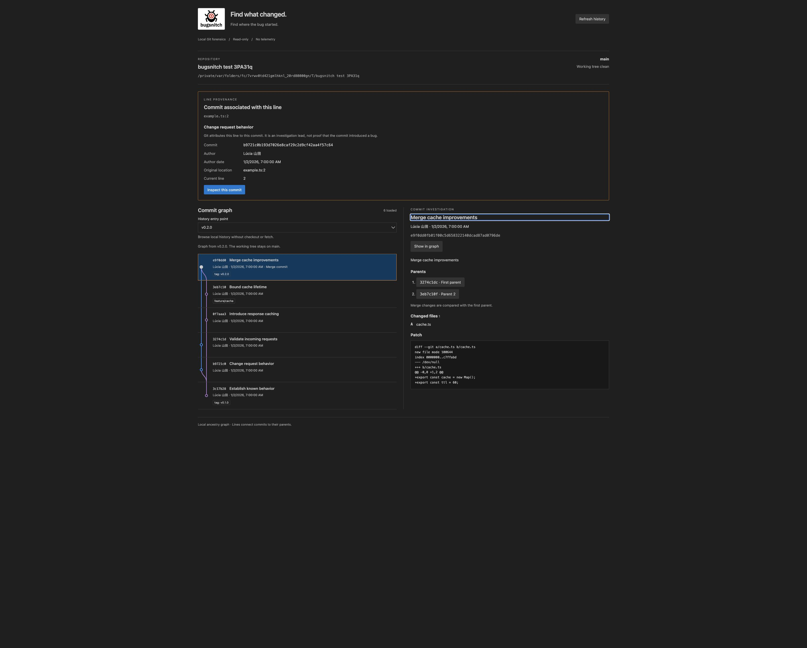

<p align="center"></p>

# Bugsnitch

**Open-source Git forensics for VS Code.**

> Find what changed. Find where the bug started.

Bugsnitch helps developers investigate code through local Git history: trace a line, inspect its associated commit, and follow the evidence in surrounding commits.

**Status: early development, building toward 0.2.0.** Version 0.1.0 is the foundation. Development now adds visual ancestry alongside the history list; regression investigation workflows remain future work.

## What works today

- **Bugsnitch: Open** shows the repository path, branch, working-tree summary, and recent commits with authors, dates, and refs.
- Graph lanes show parent ancestry, including branches and merges. Loading older pages preserves existing lane positions; dashed lanes indicate parents outside the loaded history.
- Select a commit to inspect its full message, changed files, and a bounded patch preview. Merge patches compare against the first parent.
- Refresh history or load another page. Opening Bugsnitch does not load the entire history.
- **Bugsnitch: Snitch on Current Line** traces one saved line to its originating commit and original filename/line, including committed renames where Git can follow them.
- Local changes, empty repositories, untracked files, and unavailable Git receive contextual explanations.

### Snitch on Current Line

Open a tracked text file, save any editor changes, and place the cursor on the line you want to investigate. Run **Bugsnitch: Snitch on Current Line** from the Command Palette or editor context menu. The investigation shows the author, author date, associated hash and subject, and original/current locations. Choose **Inspect this commit** for the full message, changed files, and patch, then **Show in graph** to locate it alongside its ancestry. Parent buttons let you continue the investigation.

Selection and line evidence survive refresh and pagination. If the selected commit is outside the loaded graph, **Show in graph** opens a bounded history from that commit. **Return to checkout history** restores the current checkout's history. The working tree never changes. A line-associated commit is an investigation lead, not proof that it introduced a bug.

Saved working-tree changes are supported: if the selected line has no committed origin, Bugsnitch says so. Untitled and dirty editors must be saved first. Binary files and text files larger than 4 MiB are outside this first slice.

Git content filters are bypassed for safety. Filtered files are excluded from line tracing, and repositories with configured filters show a warning that modified counts may differ from ordinary Git status. Commit inspection still works.

## Local first

Git inspection happens on your machine, using system Git. No analytics, telemetry, authentication, AI APIs, cloud uploads, or network requests run in the extension. No account or internet connection is required. Git history is read-only; Bugsnitch does not commit, reset, rebase, stash, or push. See [privacy](docs/privacy.md) and [architecture](docs/architecture.md).

## Screenshots



The built webview, displaying a real disposable Git fixture during browser verification with VS Code dark theme variables. The VS Code shell is not shown.

## Run from source

Requirements: [Node.js 24 LTS](https://github.com/nodejs/Release), system Git on `PATH`, pnpm **11.25.0** through Corepack, and VS Code **1.105.0 or later**. Node 24 is the development toolchain; the host bundle targets Node 22 APIs for the minimum supported VS Code runtime.

```sh
git clone https://github.com/lucasmkrx/bugsnitch.git
cd bugsnitch
corepack enable
corepack pnpm install --frozen-lockfile
pnpm build
```

If you use nvm, run `nvm install` and `nvm use` in the repository to select `.nvmrc`. If your Node distribution omits Corepack, install Corepack with your package manager before enabling it. The root `packageManager` pins pnpm; do not use a different major version to regenerate the lockfile.

Open this repository in VS Code and press **F5**, selecting **Bugsnitch Extension**. In the Extension Development Host, open a trusted Git workspace and run **Bugsnitch: Open**. The launch task builds automatically. For iterative work, run `pnpm dev`, then reload the development host after changes. This watches the host and production webview bundles without a remote development server.

### Install a local package

```sh
pnpm package
code --install-extension apps/vscode/bugsnitch-0.1.0.vsix
```

If the `code` CLI is unavailable, use **Extensions: Install from VSIX…** in VS Code and select the generated file. Packaging is local and does not publish. The manifest currently uses the explicitly temporary publisher `bugsnitch-dev-placeholder`. Configure the official Marketplace publisher before releasing; Bugsnitch is not advertised as available on the Marketplace yet.

### Checks

```sh
pnpm lint
pnpm format:check
pnpm typecheck
pnpm test
pnpm build
```

`pnpm format` formats source and docs. Tests create disposable Git repositories and do not depend on your history or identity. CI runs the checks on pushes and pull requests.

## Repository architecture

| Location             | Responsibility                                                        |
| -------------------- | --------------------------------------------------------------------- |
| `apps/vscode`        | Commands, editor integration, discovery, webview host and React entry |
| `packages/git`       | Safe Git processes, history/status/blame parsing, commit inspection   |
| `packages/graph`     | Stable ancestry lanes, parent edges, and page continuations           |
| `packages/forensics` | Local line investigation and commit enrichment                        |
| `packages/ui`        | Accessible React presentation using VS Code theme variables           |
| `packages/shared`    | Models and validated, versioned message contracts                     |
| `assets/brand`       | Official brand assets, governed separately from source licensing      |

The project uses strict TypeScript and pnpm workspaces, esbuild for the extension host, Vite for the React webview, and Vitest for tests. There is no separate desktop app or cloud backend.

## Roadmap

The 0.2.0 milestone connects visual ancestry, line investigation, and commit selection, and adds read-only branch/tag entry points. Later: richer comparisons, file/symbol history, investigation sessions, good/bad regression ranges, visual bisect, and related changes. Optional integrations and intelligence may follow; the local core must remain valuable on its own. See the [roadmap](docs/roadmap.md); no release dates are promised.

## Contributing and support

Read [CONTRIBUTING.md](CONTRIBUTING.md) and the [code of conduct](CODE_OF_CONDUCT.md). Report bugs and propose features in [GitHub Issues](https://github.com/lucasmkrx/bugsnitch/issues). See [SUPPORT.md](SUPPORT.md). Report exploitable vulnerabilities privately as described in [SECURITY.md](SECURITY.md).

## License and branding

Software source code is licensed under the **Mozilla Public License 2.0 (MPL-2.0)**. See the complete [LICENSE](LICENSE). Copyright © 2026 Lucas Marques.

The **Bugsnitch name, logo, visual identity, and brand assets are separate from the software license**. MPL-2.0 does not license the branding. Forks should use their own identity unless permission is granted. See [TRADEMARKS.md](TRADEMARKS.md) and [brand asset terms](assets/brand/README.md).
