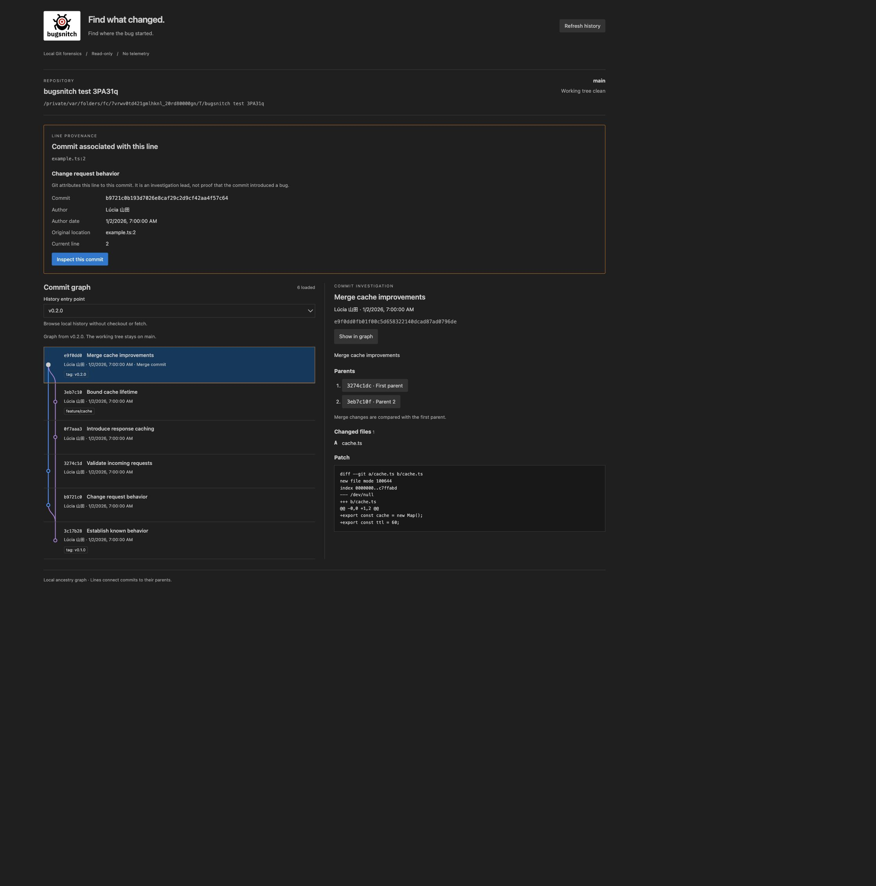

<p align="center">
  <picture>
    <source media="(prefers-color-scheme: dark)" srcset="assets/brand/bugsnitch-logo-dark.svg">
    
  </picture>
</p>

# Bugsnitch

**Open-source Git forensics for VS Code.**

> Find what changed. Find where the bug started.

Bugsnitch turns a line of code into a trail through local Git history. Inspect its associated commit, explore the ancestry graph, and browse another branch without changing your checkout.

[](https://github.com/lucasmkrx/bugsnitch/actions/workflows/ci.yml)
[](https://github.com/lucasmkrx/bugsnitch/actions/workflows/codeql.yml)
[](LICENSE)

**[Download the preview VSIX](https://github.com/lucasmkrx/bugsnitch/releases) · [Try a guided investigation](docs/demo.md) · [Read the engineering case study](docs/engineering.md)**

**0.3.0 is the current source preview.** Historical file comparisons and manual good/bad investigations are implemented; automatic regression detection and bisect remain future work. A line-associated commit is an investigation lead, not proof that it introduced a bug.



The 0.2.0 production webview displaying a real disposable Git repository with VS Code dark theme colors. This capture shows the webview; the VS Code shell is outside the image.

[Watch the 0.3.0 production-webview test journey](docs/screenshots/investigation.webm) or [see its current evidence view](docs/screenshots/investigation-current.png). The recording uses a real disposable Git repository and production UI through the browser test adapter; it does not show the VS Code shell.

## Investigate in three steps

1. **Snitch on Current Line.** Select a saved line to find its associated commit, author, and original file/line.
2. **Inspect the evidence.** Read the commit message, changed files, patch preview, and parents.
3. **Follow the graph.** Show the commit in its ancestry and explore local branches or tags while keeping your investigation context.

All Git inspection runs locally. No account, telemetry, AI API, cloud upload, or network access is required. The extension reads history without changing the working tree or index. See [privacy](docs/privacy.md).

## Install and try it

Requires **VS Code 1.105.0+**, **Git 2.39+ on `PATH`**, and a **trusted local Git workspace**.

Download the `.vsix` from [GitHub Releases](https://github.com/lucasmkrx/bugsnitch/releases). In VS Code, run **Extensions: Install from VSIX…** and select the file. Open a Git repository, then run **Bugsnitch: Open** from the Command Palette.

For line investigation, open a tracked text file, save your changes, place the cursor on a line, and run **Bugsnitch: Snitch on Current Line** from the Command Palette or editor context menu. Choose **Inspect this commit**, then **Show in graph**.

The preview uses the temporary publisher `bugsnitch-dev-placeholder`; it is distributed as a GitHub VSIX and is not available on the Marketplace. An official publisher is required before Marketplace publication. Until a release is available, [build a local package](#install-a-local-package).

## What works today

- **Bugsnitch: Open** shows the repository path, branch, working-tree summary, and recent commits with authors, dates, and refs.
- Graph lanes show the selected entry point's reachable ancestry, including branches and merges. Loading older pages preserves existing lane positions; dashed lanes indicate parents outside the loaded history.
- Browse local branches, remote-tracking branches, and commit tags from the **History entry point** selector. No checkout or fetch occurs; the repository overview always shows the actual checkout. Annotated tags are peeled to their commits.
- Select a commit to inspect its full message, changed files, and a bounded patch preview. Merge patches start with the first parent and let you choose another parent. Per-file patches, native historical diffs and rename-following file history connect the evidence.
- Mark known-good and known-bad commits, freeze an ancestor-validated candidate range, record manual assessments and explicitly export notes.
- Search loaded commits and filter local refs.
- Refresh history or load another page. Opening Bugsnitch does not load the entire history.
- **Bugsnitch: Snitch on Current Line** traces one saved line to its originating commit and original filename/line, including committed renames where Git can follow them.
- Local changes, empty repositories, untracked files, and unavailable Git receive contextual explanations.

Read the [usage guide](docs/usage.md) for pagination, shallow clones, file-size limits, and configured Git filter behavior.

## Run from source

Requirements: [Node.js 24 LTS](https://github.com/nodejs/Release), system Git on `PATH`, pnpm **11.25.0** through Corepack, and VS Code **1.105.0 or later**. Node 24 is the development toolchain; the host bundle targets Node 22 APIs for the minimum supported VS Code runtime.

```sh
git clone https://github.com/lucasmkrx/bugsnitch.git
cd bugsnitch
corepack enable
corepack pnpm install --frozen-lockfile
pnpm build
```

If you use nvm, run `nvm install` and `nvm use` in the repository to select `.nvmrc`. If your Node distribution omits Corepack, install Corepack with your package manager before enabling it. The root `packageManager` pins pnpm; do not use a different major version to regenerate the lockfile.

Open this repository in VS Code and press **F5**, selecting **Bugsnitch Extension**. In the Extension Development Host, open a trusted Git workspace and run **Bugsnitch: Open**. The launch task builds automatically. For iterative work, run `pnpm dev`, then reload the development host after changes. This watches the host and production webview bundles without a remote development server.

### Install a local package

```sh
pnpm package
code --install-extension apps/vscode/bugsnitch-0.3.0.vsix
```

If the `code` CLI is unavailable, use **Extensions: Install from VSIX…** in VS Code and select the generated file. Packaging is local and does not publish. The manifest currently uses the explicitly temporary publisher `bugsnitch-dev-placeholder`. Configure the official Marketplace publisher before releasing; Bugsnitch is not advertised as available on the Marketplace yet.

### Checks

```sh
pnpm lint
pnpm format:check
pnpm typecheck
pnpm test
pnpm build
pnpm test:extension
pnpm test:package
pnpm exec playwright install chromium
pnpm test:browser
```

`pnpm format` formats source and docs. Tests create disposable Git repositories and do not depend on your history or identity. `test:extension` launches an isolated VS Code using Microsoft's test runner; its first run downloads VS Code. See [validation](docs/validation.md) for platform coverage and the scope of each check.

## Repository architecture

| Location             | Responsibility                                                        |
| -------------------- | --------------------------------------------------------------------- |
| `apps/vscode`        | Commands, editor integration, discovery, webview host and React entry |
| `packages/git`       | Safe Git processes, history/status/blame parsing, commit inspection   |
| `packages/graph`     | Stable ancestry lanes, parent edges, and page continuations           |
| `packages/forensics` | Local line investigation and commit enrichment                        |
| `packages/ui`        | Accessible React presentation using VS Code theme variables           |
| `packages/shared`    | Models and validated, versioned message contracts                     |
| `assets/brand`       | Official brand assets, governed separately from source licensing      |

The project uses strict TypeScript and pnpm workspaces, esbuild for the extension host, Vite for the React webview, and Vitest for tests. There is no separate desktop app or cloud backend.

See the [measured performance report](docs/performance.md) and [compatibility contract](docs/compatibility.md). The [engineering case study](docs/engineering.md) explains stable graph pagination, investigation state, and the Git/webview trust boundary. The [architecture](docs/architecture.md) describes package responsibilities and data flow.

## Roadmap

The 0.3.0 source adds historical comparisons, file history, in-memory sessions and manual good/bad ranges to visual ancestry and line investigation. Later: symbol history, visual bisect, and related changes. Optional integrations and intelligence may follow; the local core must remain valuable on its own. See the [roadmap](docs/roadmap.md); no release dates are promised.

## Contributing and support

Read [CONTRIBUTING.md](CONTRIBUTING.md) and the [code of conduct](CODE_OF_CONDUCT.md). Report bugs and propose features in [GitHub Issues](https://github.com/lucasmkrx/bugsnitch/issues). See [SUPPORT.md](SUPPORT.md). Report exploitable vulnerabilities privately as described in [SECURITY.md](SECURITY.md).

## License and branding

Software source code is licensed under the **Mozilla Public License 2.0 (MPL-2.0)**. See the complete [LICENSE](LICENSE). Copyright © 2026 Lucas Marques.

The **Bugsnitch name, logo, visual identity, and brand assets are separate from the software license**. MPL-2.0 does not license the branding. Forks should use their own identity unless permission is granted. See [TRADEMARKS.md](TRADEMARKS.md) and [brand asset terms](assets/brand/README.md).
