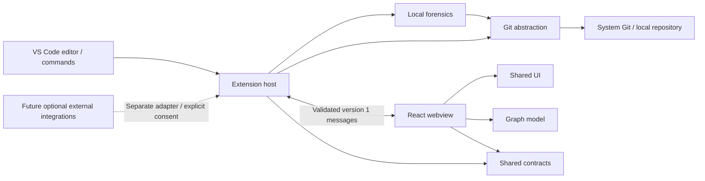

# Architecture

Bugsnitch is a pnpm TypeScript monorepo. Node 24 is the development toolchain; esbuild emits a CommonJS extension bundle targeting Node 22 and keeps `vscode` external. Vite emits a self-contained React IIFE and local CSS. Internal workspace packages expose TypeScript source for bundling and are private, not independently published artifacts.

## Package boundaries

- `apps/vscode` owns activation, trusted-workspace checks, commands, repository selection, cancellation, panels, resource URIs, and message routing. It is the only package importing VS Code APIs.
- `packages/git` discovers a repository with `rev-parse`, reads status/branch/HEAD and local refs, peels tags in a batched local object read, paginates history, inspects commits, and traces one line. Parsing is independently testable. Git is resolved from system `PATH`; missing executables produce a contextual error.
- `packages/forensics` combines line blame with the originating full commit. It does not infer suspicious commits or claim regression detection yet.
- `packages/graph` lays out child-before-parent history with reserved parent lanes, including branches and multi-parent merges. Appending a page preserves prior node and line positions. Dashed continuations identify parents outside loaded history. The webview draws these lanes beside the shared commit rows; Git data, rather than decoration text or commit dates, determines ancestry.
- `packages/ui` provides semantic React history and investigation components, with VS Code light/dark/high-contrast colors and visible keyboard focus.
- `packages/shared` defines serializable data and validates both protocol directions. It depends on neither VS Code nor Node.

## Data flow and performance

`Open` prefers the active file's repository, then workspace roots. Multiple roots use a picker; nested repositories are discovered from the active file. This release does not recursively scan workspaces for every repository.

Each panel reads a snapshot and at most 50 commits by default (configurable 10–200), plus one lookahead. Subsequent pages use a frozen history anchor's full commit ID and an offset, avoiding duplicates if the branch moves. Refresh resets pagination. Refs and status update on refresh; no filesystem watchers or indexer run in the background. Concurrent requests in one panel are serialized and commit requests are restricted to IDs already supplied to that panel, its line investigation, or an inspected commit's parents.

Selection, commit detail, and line evidence are independent of the loaded graph. Show in graph focuses an already loaded row; for an unloaded selected commit, it reads a bounded history anchored at that commit rather than preloading every intervening page. A return anchor preserves the previous branch/tag/HEAD entry point while keeping investigation context. The repository overview always describes the actual checkout.

The history selector lists up to 2,000 local branch, remote-tracking, and tag refs, disclosing truncation. `for-each-ref` supplies names; one `cat-file --batch-check` read peels each name with `^{commit}`, including nested annotated tags. Non-commit tags are omitted. Webview ref requests must match a host-supplied name, and history is anchored at the resulting full commit ID. Only refresh or an entry-point change re-reads refs. A failed read preserves the prior snapshot, ref list, anchor, pagination offset, and allowlist. No checkout or fetch is performed.

Git processes are asynchronous, cancellable, and time out after 30 seconds. Output is bounded to 8 MiB; patch previews retain at most 256 KiB and disclose truncation. Blame accepts text up to 4 MiB. Closing a panel cancels its reads. Line investigation uses VS Code's cancellable progress UI. No entire-history preload or database is required, although a user can explicitly load successive pages into panel memory.

## Trust boundaries

The extension host treats the webview as untrusted. Only `ready`, `refresh`, `loadMore`, `inspectCommit`, `focusCommit`, `selectRef`, `returnToHead`, and `returnToHistory` are supported. Messages require a protocol version and exact fields; commit IDs must be complete SHA-1 or SHA-256 hexadecimal object IDs, then pass the panel allowlist. Ref names must pass shape validation and match the host's current local ref list. No message supplies a process command or repository path.

Git commands use `spawn` with argument arrays and `shell: false`. Pathspecs are literal, revisions are validated, and file paths must remain inside the selected root. Read commands suppress optional locks and configured external diff/textconv/fsmonitor execution. Ambient `GIT_*` variables are removed to prevent unexpected repository redirection. Git's safe-directory checks are respected. Repository content is never inserted into HTML; React escapes textual values.

Before each operation, the runner reads only Git content-filter configuration names and disables their clean, smudge, and process commands with explicit overrides. Concurrent configuration reads are coalesced; results are not retained across operations. Signature verification is disabled as well. Status warns when filters were bypassed; line tracing refuses filtered files because transformed contents may invalidate line provenance. These boundaries prevent ordinary read commands from implicitly running configured helpers.

The runner sets `GIT_NO_LAZY_FETCH=1` and an empty `GIT_ALLOW_PROTOCOL` transport allowlist. This prevents partial-clone reads from contacting remotes, including when an older Git does not recognize the lazy-fetch variable. Missing local objects fail contextually rather than triggering hydration.

The webview permits only packaged resources below `dist` via `asWebviewUri`. Its CSP defaults to deny, allows a fresh nonce for the bundled script, local styles/images, and explicitly denies connections, forms, and base URLs. No remote resources, inline JavaScript, command URIs, or arbitrary filesystem access are enabled.

## Packaging and licensing

`pnpm build` produces the host/webview bundles, copies brand terms, and renders the unmodified supplied SVG as a PNG icon for packaging. `pnpm package` produces a VSIX locally with bundled dependencies; no install-time dependency resolution is needed. Root license/trademark/changelog files are copied into the extension staging directory and ignored in Git.

Source uses MPL-2.0 SPDX notices. The canonical MPL text is included verbatim; brand assets and PNG derivatives are governed by TRADEMARKS.md, separately from source licensing. Third-party bundled code retains its applicable licenses.

## Optional external services

There is no cloud implementation or cloud dependency. Future integrations must enter through separately defined adapters and explicit user choices; they must not turn the local Git or forensic packages into network clients. A possible private `bugsnitch-cloud` repository would be an external system. Local provenance and investigation should remain useful independently.
