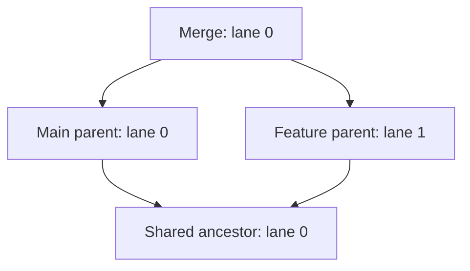

# Engineering Bugsnitch

Bugsnitch connects a saved line to commit inspection and visual ancestry while reading an existing Git repository. The useful engineering constraints are correctness across partial history, retained investigation context, and controlled execution of repository configuration.

## Stable ancestry under pagination

Git supplies commits in child-before-parent topological order. A date-sorted list can place a parent before its child when timestamps are unusual; drawing ancestry from dates would be incorrect.

The [graph model](../packages/graph/src/index.ts) reserves a lane for each pending parent. When a parent arrives, its node occupies that lane. Additional parents allocate lanes; children converging on the same parent share the reservation. Completed lanes can be reused, but live lanes are never compacted.

Because each row depends only on earlier rows and the current commit's parents, appending an older page leaves the existing nodes and segments unchanged. Parents beyond the page remain explicit continuations. Octopus merges use the same parent-reservation rule.

This favors a stable investigation over a tightly compacted graph. A history with many simultaneously pending branches can become wide. The current implementation recomputes the loaded prefix and scans/copies the lane array per row, so layout cost depends on both loaded commit count and lane width. It is intentionally simple; incremental state or indexed reservations should be justified by measurements before adding complexity.

The [graph tests](../packages/graph/src/index.test.ts) follow the drawn segments to their parents independently of ancestry metadata. They check every prefix of crossed and octopus merge fixtures, missing parents, lane reuse, and a 5,000-commit linear history. [Git integration tests](../apps/vscode/webview/graph.integration.test.ts) also use a real merge repository. These establish correctness for the tested cases, rather than a universal performance guarantee.

## Investigation state survives navigation

The selected commit, inspected detail, and line evidence are separate from the loaded graph. This lets a developer change a history entry point without losing why they started investigating.

An associated commit may be thousands of commits behind the current tip. **Show in graph** opens bounded ancestry directly from that known commit instead of loading every intervening page. A return anchor preserves the previous entry point. Pages use the entry point's frozen full commit ID; refresh deliberately resolves its latest tip.

A race found during implementation illustrates the boundary: a new editor investigation can arrive while an older inspection is reading Git. Publishing the old detail last would replace the developer's newer selection. The [panel](../apps/vscode/src/panel.ts) discards stale inspection output and publishes the newest pending investigation after the read. A [real-repository panel test](../apps/vscode/src/panel.test.ts) reproduces that ordering. [PR #3](https://github.com/lucasmkrx/bugsnitch/pull/3) contains the implementation and validation context.

## A read operation can still execute helpers

The webview cannot submit a command, filesystem path, arbitrary revision, or unlisted ref. Versioned message validators and panel allowlists restrict navigation to host-supplied objects. React escapes repository text, and a deny-by-default content security policy permits packaged resources only.

Git runs asynchronously with argument arrays and no shell. Reads have cancellation, a 30-second timeout, an 8 MiB output ceiling, and smaller patch/blame limits. Repository configuration needs its own boundary: ordinary reads can invoke content filters, external diffs, fsmonitor, signature programs, or partial-clone fetching. Bugsnitch disables these helpers, removes ambient `GIT_*` redirection, and blocks transport protocols. Filtered files are excluded from line tracing because bypassing a transform can change attribution.

The [architecture document](architecture.md) details these decisions; [Git tests](../packages/git/src/repository.test.ts) check literal paths, helper suppression, partial clones, and failure behavior. The [extension-host test](../apps/vscode/test/extension-host.ts) exercises both commands and navigation inside VS Code while verifying that HEAD, index bytes, and working files remain unchanged.

## Evidence review and release validation

The production browser harness uses the actual panel controller and webview bundle with a narrow VS Code API adapter and real temporary Git repositories. It clicks through pagination, inspection, known-good/bad ranges, notes and file history, checks focus and runs axe WCAG A/AA scans at narrow and wide widths in representative light/dark/high-contrast colors. This complements the editor host test rather than pretending Chromium is VS Code.

The installed smoke packages and validates a VSIX, installs those exact bytes into a disposable editor profile and runs the real commands, bundled webview readiness, native historical diff and explicit export. Adding the observer runner beside the installed resources gives it the same VS Code API scope; the packaged manifest and runtime resources are unchanged. A regression found here was that native diff navigation could replace the investigation editor group and dispose its content provider. Opening beside the panel fixed that observable lifecycle bug.

Known-good and known-bad endpoints must pass ancestry validation. The resulting candidate set freezes full object IDs and metadata, with explicit truncation. Assessments and notes are deliberately human-authored: the tool supplies evidence while the reproduction input/output supports the conclusion. Export is explicit, and session data stays in memory. Blame alone never proves causation.

[Performance measurements](performance.md) document fixture shape, warm caches, sample counts, graph width and memory limitations. [Validation](validation.md) records automated boundaries and outstanding human checks. This project demonstrates editor integration, React UI, process isolation, versioned contracts, asynchronous ordering, graph algorithms and artifact verification; it has no server backend or production adoption claim.
